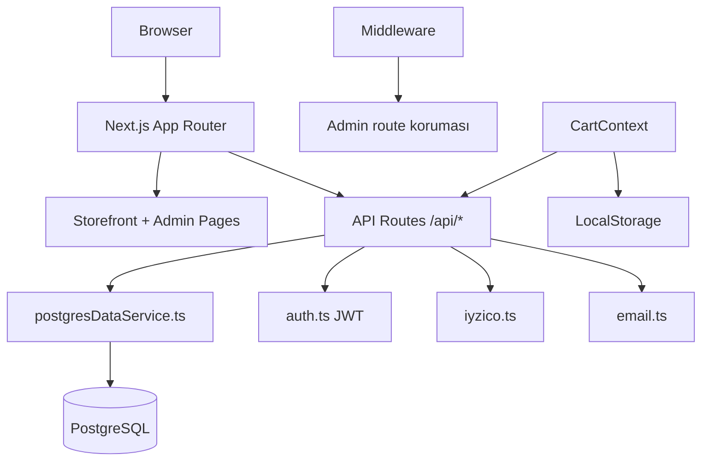
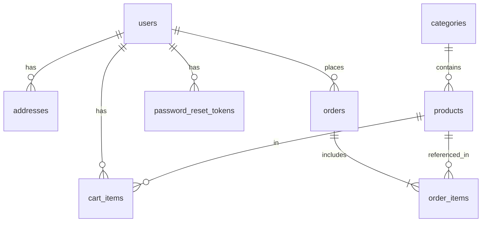
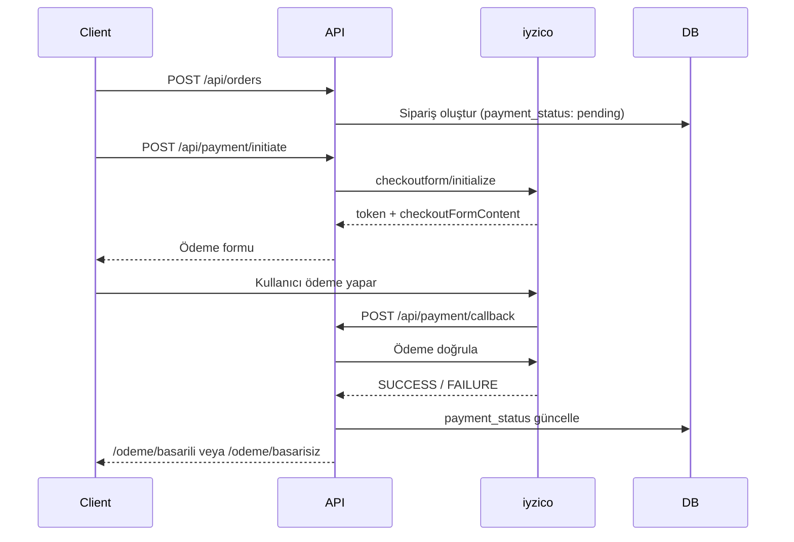

# Mertem Grup E-Ticaret — Teknik Dokümantasyon

Bu doküman, **Mertem Grup E-Ticaret** projesinin geliştiriciler için kapsamlı teknik referansıdır. Hızlı kurulum adımları için [README.md](README.md) dosyasına bakın.

---

## İçindekiler

1. [Proje Özeti](#1-proje-özeti)
2. [Mimari](#2-mimari)
3. [Klasör Yapısı](#3-klasör-yapısı)
4. [Veritabanı Şeması](#4-veritabanı-şeması)
5. [Kimlik Doğrulama (Auth)](#5-kimlik-doğrulama-auth)
6. [API Referansı](#6-api-referansı)
7. [Ödeme Sistemi](#7-ödeme-sistemi)
8. [Sepet Mekanizması](#8-sepet-mekanizması)
9. [Sipariş Yaşam Döngüsü](#9-sipariş-yaşam-döngüsü)
10. [Admin Paneli](#10-admin-paneli)
11. [Storefront Sayfa Haritası](#11-storefront-sayfa-haritası)
12. [Ortam Değişkenleri](#12-ortam-değişkenleri)
13. [Kurulum ve Çalıştırma](#13-kurulum-ve-çalıştırma)
14. [Yararlı Scriptler](#14-yararlı-scriptler)
15. [Bilinen Sınırlamalar ve Notlar](#15-bilinen-sınırlamalar-ve-notlar)

---

## 1. Proje Özeti

**Mertem Grup E-Ticaret**, inşaat malzemeleri ve hırdavat toptan satışına yönelik tam kapsamlı bir e-ticaret uygulamasıdır. Tek bir Next.js 15 uygulaması içinde hem mağaza arayüzü hem de REST API barındırır; ayrı bir backend sunucusu yoktur.

### Teknoloji Özeti

| Katman | Teknoloji |
|--------|-----------|
| Framework | Next.js 15 (App Router), React 19, TypeScript |
| Stil | Tailwind CSS v4, Lucide ikonları, Inter font |
| Veritabanı | PostgreSQL 16 (`pg` connection pool) |
| Kimlik doğrulama | JWT (`jose`), bcrypt (cost 12), httpOnly cookie |
| Ödeme | iyzico (kredi kartı), havale, kapıda ödeme |
| E-posta | Nodemailer (SMTP) |
| Konum verisi | `turkey-neighbourhoods`, `src/data/turkiye-locations.json` |
| Önbellek | Next.js `unstable_cache`, React `cache()` |

### Mimari Yaklaşım

- **Monolitik fullstack:** Frontend sayfaları ve `/api/*` route'ları aynı Next.js projesindedir.
- **PostgreSQL tek kaynak:** Runtime'da tüm veriler PostgreSQL'den okunur; `src/data/*.ts` dosyaları yalnızca ilk kurulumda seed verisi sağlar.
- **Graceful degradation:** iyzico veya SMTP yapılandırılmamışsa uygulama çalışmaya devam eder (kredi kartı devre dışı, e-postalar konsola yazılır).

---

## 2. Mimari



### Veri Akışı

1. **Storefront sayfaları** sunucu bileşenlerinde `src/lib/server-data.ts` üzerinden önbellekli katalog sorguları yapar.
2. **API route'ları** `src/lib/db/postgresDataService.ts` üzerinden ham SQL ile PostgreSQL'e erişir.
3. **İstemci durumu** `AuthContext` ve `CartContext` ile yönetilir.
4. **Admin koruması** `src/middleware.ts` ile `/admin/*` ve `/api/admin/*` yollarında JWT `role === "admin"` kontrolü yapılır.

### Temel Dosyalar

| Dosya | Rol |
|-------|-----|
| `src/lib/db/postgres.ts` | Connection pool, şema oluşturma, seed |
| `src/lib/db/postgresDataService.ts` | Tüm CRUD ve iş mantığı (~50 fonksiyon) |
| `src/lib/auth.ts` | JWT oluşturma/doğrulama, cookie yönetimi |
| `src/lib/payment/iyzico.ts` | iyzico checkout, ödeme doğrulama, iade |
| `src/lib/email.ts` | Sipariş, şifre sıfırlama, iletişim e-postaları |
| `src/middleware.ts` | Admin route koruması |
| `src/types/index.ts` | Paylaşılan TypeScript arayüzleri |

---

## 3. Klasör Yapısı

```
E-Ticaret/
├── src/
│   ├── app/                    # App Router sayfaları ve API route'ları
│   │   ├── api/                # REST API endpoint'leri
│   │   ├── admin/              # Admin panel sayfaları
│   │   ├── urunler/            # Mağaza sayfaları
│   │   └── ...
│   ├── components/
│   │   ├── admin/              # AdminShell, AdminOrderAlerts vb.
│   │   ├── layout/             # SiteShell, Header, Footer
│   │   └── ...                 # Ürün kartları, formlar
│   ├── context/
│   │   ├── AuthContext.tsx     # İstemci oturum durumu
│   │   └── CartContext.tsx     # Sepet (localStorage + sunucu senkronu)
│   ├── data/
│   │   ├── products.ts         # Seed ürün verisi
│   │   ├── categories.ts       # Seed kategori verisi
│   │   ├── brands.ts           # Seed marka verisi
│   │   ├── site.ts             # Şirket bilgileri (telefon, WhatsApp vb.)
│   │   └── turkiye-locations.json
│   ├── lib/
│   │   ├── db/                 # postgres.ts, postgresDataService.ts
│   │   ├── payment/            # iyzico.ts
│   │   ├── auth.ts
│   │   ├── email.ts
│   │   ├── server-data.ts      # Önbellekli sunucu sorguları
│   │   └── utils.ts
│   ├── types/index.ts          # Paylaşılan tipler
│   └── middleware.ts
├── public/
│   ├── products/               # Ürün görselleri
│   └── uploads/products/       # Admin yüklemeleri
├── scripts/                    # DB kurulum, katalog import araçları
├── docker-compose.yml          # PostgreSQL 16 container
├── .env.example
├── README.md
└── DOCUMENTATION.md            # Bu dosya
```

---

## 4. Veritabanı Şeması

Şema tanımı: `src/lib/db/postgres.ts` → `initPostgresSchema()`  
Şema sürümü: `schema_meta` tablosunda `schema_version = 2`

### ER Diyagramı



### Tablolar

#### `users`

| Alan | Tip | Açıklama |
|------|-----|----------|
| id | TEXT PK | UUID |
| email | TEXT UNIQUE | Kullanıcı e-postası |
| password_hash | TEXT | bcrypt hash |
| name | TEXT | Ad soyad |
| phone | TEXT | Telefon (opsiyonel) |
| role | TEXT | `user` veya `admin` |
| created_at | TIMESTAMPTZ | Kayıt tarihi |

#### `categories`

| Alan | Tip | Açıklama |
|------|-----|----------|
| id | TEXT PK | UUID |
| name | TEXT | Kategori adı |
| slug | TEXT UNIQUE | URL slug |
| icon | TEXT | Lucide ikon adı |
| product_count | INTEGER | Ürün sayısı (cache) |
| image | TEXT | Görsel URL (opsiyonel) |
| description | TEXT | Açıklama (opsiyonel) |

#### `brands`

| Alan | Tip | Açıklama |
|------|-----|----------|
| id | TEXT PK | UUID |
| name | TEXT | Marka adı |
| slug | TEXT UNIQUE | URL slug |

> **Not:** `products.brand` metin alanıdır; `brands` tablosuna FK değildir.

#### `products`

| Alan | Tip | Açıklama |
|------|-----|----------|
| id | TEXT PK | UUID |
| sku | TEXT UNIQUE | Stok kodu |
| name | TEXT | Ürün adı |
| slug | TEXT UNIQUE | URL slug |
| brand | TEXT | Marka adı |
| category_id | TEXT FK | `categories.id` |
| price_ex_vat | NUMERIC(12,2) | KDV hariç fiyat |
| price_inc_vat | NUMERIC(12,2) | KDV dahil fiyat |
| unit | TEXT | Birim (ADET, M2 vb.) |
| pack_size | INTEGER | Paket boyutu (opsiyonel) |
| pack_unit | TEXT | Paket birimi (opsiyonel) |
| in_stock | BOOLEAN | Stokta mı |
| stock_qty | INTEGER | Stok adedi |
| is_new | BOOLEAN | Yeni ürün etiketi |
| is_restocked | BOOLEAN | Yeniden stok etiketi |
| image | TEXT | Görsel URL |
| description | TEXT | Açıklama |
| features | TEXT | `||` ile ayrılmış özellik listesi |

#### `orders`

| Alan | Tip | Açıklama |
|------|-----|----------|
| id | TEXT PK | UUID |
| order_number | TEXT UNIQUE | Sipariş numarası (ör. MRT-20250805-001) |
| user_id | TEXT FK | Kayıtlı kullanıcı (misafir siparişlerde NULL) |
| email | TEXT | Müşteri e-postası |
| customer_name | TEXT | Müşteri adı |
| phone | TEXT | Telefon |
| status | TEXT | Sipariş durumu |
| payment_status | TEXT | Ödeme durumu |
| payment_method | TEXT | `credit_card`, `bank_transfer`, `cash_on_delivery` |
| total_ex_vat | NUMERIC(12,2) | KDV hariç toplam |
| total_inc_vat | NUMERIC(12,2) | KDV dahil toplam |
| discount_amount | NUMERIC(12,2) | Kupon indirimi |
| coupon_code | TEXT | Uygulanan kupon |
| shipping_address | JSONB | Teslimat adresi |
| notes | TEXT | Sipariş notu |
| tracking_number | TEXT | Kargo takip numarası |
| cargo_company | TEXT | Kargo firması |
| payment_id | TEXT | iyzico ödeme ID |
| guest_token | TEXT | Misafir sipariş takip token'ı |
| created_at / updated_at | TIMESTAMPTZ | Zaman damgaları |

#### `order_items`

| Alan | Tip | Açıklama |
|------|-----|----------|
| id | TEXT PK | UUID |
| order_id | TEXT FK | `orders.id` (CASCADE DELETE) |
| product_id | TEXT | Ürün ID (snapshot) |
| product_name | TEXT | Ürün adı (snapshot) |
| sku | TEXT | SKU (snapshot) |
| quantity | INTEGER | Adet |
| unit_price_ex_vat | NUMERIC(12,2) | Birim fiyat KDV hariç |
| unit_price_inc_vat | NUMERIC(12,2) | Birim fiyat KDV dahil |

#### `cart_items`

| Alan | Tip | Açıklama |
|------|-----|----------|
| id | TEXT PK | UUID |
| user_id | TEXT FK | `users.id` (CASCADE DELETE) |
| product_id | TEXT FK | `products.id` (CASCADE DELETE) |
| quantity | INTEGER | Adet |
| UNIQUE | (user_id, product_id) | Kullanıcı başına bir satır |

#### `addresses`

| Alan | Tip | Açıklama |
|------|-----|----------|
| id | TEXT PK | UUID |
| user_id | TEXT FK | `users.id` |
| label | TEXT | Adres etiketi (Ev, İş vb.) |
| full_name | TEXT | Alıcı adı |
| phone | TEXT | Telefon |
| address_line | TEXT | Adres satırı |
| city | TEXT | İl |
| district | TEXT | İlçe |
| postal_code | TEXT | Posta kodu (opsiyonel) |
| is_default | BOOLEAN | Varsayılan adres |
| created_at | TIMESTAMPTZ | Oluşturma tarihi |

#### `coupons`

| Alan | Tip | Açıklama |
|------|-----|----------|
| id | TEXT PK | UUID |
| code | TEXT UNIQUE | Kupon kodu |
| type | TEXT | `percent` veya `fixed` |
| value | NUMERIC(12,2) | İndirim değeri (% veya TL) |
| min_order_inc_vat | NUMERIC(12,2) | Minimum sipariş tutarı |
| max_uses | INTEGER | Maksimum kullanım (NULL = sınırsız) |
| used_count | INTEGER | Kullanım sayısı |
| active | BOOLEAN | Aktif mi |
| expires_at | TIMESTAMPTZ | Son kullanma (opsiyonel) |
| created_at | TIMESTAMPTZ | Oluşturma tarihi |

#### Diğer Tablolar

| Tablo | Açıklama |
|-------|----------|
| `password_reset_tokens` | SHA-256 hash'lenmiş sıfırlama token'ları |
| `contact_messages` | İletişim formu mesajları |
| `schema_meta` | Şema sürüm takibi |

### İndeksler

- `products`: category_id, slug, name, brand, sku, stock_qty, is_new, is_restocked
- `orders`: email, order_number, user_id
- `addresses`: user_id
- `cart_items`: user_id
- `coupons`: code
- `password_reset_tokens`: token_hash

---

## 5. Kimlik Doğrulama (Auth)

Kaynak dosyalar: `src/lib/auth.ts`, `src/middleware.ts`, `src/context/AuthContext.tsx`

### JWT Cookie

| Özellik | Değer |
|---------|-------|
| Cookie adı | `mertem-token` |
| Algoritma | HS256 |
| Süre | 7 gün |
| Özellikler | httpOnly, sameSite: lax, secure (production) |
| Payload | `{ userId, email, role }` |

### Akışlar

#### Kayıt
1. `POST /api/auth/register` → e-posta benzersizlik kontrolü
2. bcrypt ile şifre hash'leme (cost 12)
3. JWT oluşturma ve cookie set etme
4. Otomatik giriş

#### Giriş
1. `POST /api/auth/login` → e-posta + şifre doğrulama
2. JWT oluşturma → `mertem-token` cookie
3. `{ success: true, data: User }` döner

#### Oturum Kontrolü
1. `GET /api/auth/me` → cookie'den JWT okuma
2. JWT doğrulama → DB'den kullanıcı yükleme

#### Çıkış
1. `POST /api/auth/logout` → cookie silme

#### Şifre Sıfırlama
1. `POST /api/auth/forgot-password` → rastgele token üretimi
2. Token SHA-256 ile hash'lenip `password_reset_tokens` tablosuna yazılır
3. E-posta ile sıfırlama linki gönderilir (`/sifre-sifirla?token=...`)
4. `POST /api/auth/reset-password` → token doğrulama, şifre güncelleme, token tüketme
5. Enumeration-safe: kayıtlı olmayan e-posta için de başarılı yanıt döner

### Admin Koruması

**Middleware** (`src/middleware.ts`):
- Matcher: `/admin/:path*`, `/api/admin/:path*`
- JWT `role !== "admin"` → API: 403 JSON, sayfa: `/giris?redirect=/admin` yönlendirmesi

**API route'larında** ek olarak `requireAuth("admin")` kullanılır.

### Roller

| Rol | Yetkiler |
|-----|----------|
| `user` | Mağaza, sepet, sipariş, profil, adresler |
| `admin` | Tüm kullanıcı yetkileri + admin paneli + admin API |

---

## 6. API Referansı

Tüm endpoint'ler `src/app/api/` altında Next.js App Router `route.ts` dosyalarıdır.

**Genel yanıt formatı:**

```json
{ "success": true, "data": { ... } }
{ "success": false, "message": "Hata açıklaması" }
```

**HTTP durum kodları:** 200 (başarı), 400 (geçersiz istek), 401 (giriş gerekli), 403 (yetkisiz), 404 (bulunamadı), 500 (sunucu hatası)

---

### Health (1 endpoint)

| Metod | Path | Auth | Açıklama |
|-------|------|------|----------|
| GET | `/api/health` | Hayır | DB bağlantı kontrolü, şema init |

**Yanıt örneği:**
```json
{ "success": true, "data": { "database": "connected" } }
```

---

### Auth (6 endpoint)

| Metod | Path | Auth | Açıklama |
|-------|------|------|----------|
| POST | `/api/auth/login` | Hayır | Giriş yap, cookie set et |
| POST | `/api/auth/register` | Hayır | Kayıt ol, otomatik giriş |
| POST | `/api/auth/logout` | Hayır | Cookie sil |
| GET | `/api/auth/me` | Cookie | Mevcut kullanıcı bilgisi |
| POST | `/api/auth/forgot-password` | Hayır | Şifre sıfırlama e-postası |
| POST | `/api/auth/reset-password` | Hayır | Yeni şifre belirle |

**Login istek:**
```json
{ "email": "user@example.com", "password": "sifre123" }
```

**Register istek:**
```json
{ "email": "user@example.com", "password": "sifre123", "name": "Ad Soyad", "phone": "05551234567" }
```

**Reset password istek:**
```json
{ "token": "abc123...", "password": "yeniSifre123" }
```

---

### Catalog (6 endpoint)

| Metod | Path | Auth | Açıklama |
|-------|------|------|----------|
| GET | `/api/products` | Hayır | Sayfalı ürün listesi |
| GET | `/api/products/[slug]` | Hayır | Slug ile tek ürün |
| POST | `/api/products/validate` | Hayır | Sepet ürün ID/stok doğrulama |
| GET | `/api/categories` | Hayır | Tüm kategoriler |
| GET | `/api/categories/[slug]` | Hayır | Slug ile kategori |
| GET | `/api/brands` | Hayır | Tüm markalar |

**GET /api/products query parametreleri:**

| Parametre | Tip | Açıklama |
|-----------|-----|----------|
| category | string | Kategori slug veya ID |
| brand | string | Marka slug veya adı |
| search | string | Arama metni |
| page | number | Sayfa numarası (varsayılan: 1) |
| limit | number | Sayfa boyutu (varsayılan: 24) |
| new | boolean | Sadece yeni ürünler |
| restocked | boolean | Sadece yeniden stoklananlar |
| inStock | boolean | Sadece stokta olanlar |

**POST /api/products/validate istek:**
```json
{ "ids": ["uuid-1", "uuid-2"] }
```

**Yanıt:**
```json
{
  "success": true,
  "data": {
    "valid": [ { "id": "...", "name": "...", "stockQty": 50, ... } ],
    "invalid": ["uuid-eski-id"]
  }
}
```

---

### Cart (3 endpoint) — Auth gerekli

| Metod | Path | Açıklama |
|-------|------|----------|
| GET | `/api/cart` | Kullanıcının sepetini getir |
| PUT | `/api/cart` | Sepeti tamamen değiştir |
| DELETE | `/api/cart` | Sepeti temizle |

**PUT istek:**
```json
{
  "items": [
    { "productId": "uuid", "quantity": 2 }
  ]
}
```

---

### Orders (3 endpoint)

| Metod | Path | Auth | Açıklama |
|-------|------|------|----------|
| GET | `/api/orders` | Evet | Kullanıcının siparişleri |
| POST | `/api/orders` | Kısmen | Sipariş oluştur (misafir veya üye) |
| GET | `/api/orders/track` | Hayır | Misafir sipariş takibi |

**POST /api/orders istek:**
```json
{
  "items": [{ "productId": "uuid", "quantity": 2 }],
  "customerName": "Ad Soyad",
  "email": "user@example.com",
  "phone": "05551234567",
  "shippingAddress": {
    "fullName": "Ad Soyad",
    "phone": "05551234567",
    "addressLine": "Mahalle Sokak No:1",
    "city": "İstanbul",
    "district": "Kadıköy",
    "postalCode": "34700"
  },
  "paymentMethod": "bank_transfer",
  "notes": "Kapıda arayın",
  "couponCode": "INDIRIM10"
}
```

**GET /api/orders/track query:**
```
?email=user@example.com&orderNumber=MRT-20250805-001
```

**Olası sipariş hataları:**

| Kod | Mesaj |
|-----|-------|
| INSUFFICIENT_STOCK | Yetersiz stok |
| OUT_OF_STOCK | Stokta yok |
| PRODUCT_NOT_FOUND | Ürün satışta değil |
| COUPON_INVALID / EXPIRED / EXHAUSTED / MIN_ORDER | Kupon hataları |
| EMPTY_CART | Sepet boş |

---

### Payment (3 endpoint)

| Metod | Path | Auth | Açıklama |
|-------|------|------|----------|
| POST | `/api/payment/initiate` | Hayır | iyzico checkout başlat |
| GET | `/api/payment/initiate?token=` | Hayır | Ödeme durumu sorgula |
| POST | `/api/payment/callback` | Hayır | iyzico form callback |

**POST /api/payment/initiate istek:**
```json
{ "orderId": "uuid", "buyerIp": "127.0.0.1" }
```

**Yanıt:**
```json
{
  "success": true,
  "data": {
    "token": "iyzico-token",
    "checkoutFormContent": "<script>...</script>",
    "paymentPageUrl": "https://..."
  }
}
```

---

### Account (5 endpoint) — Auth gerekli

| Metod | Path | Açıklama |
|-------|------|----------|
| PATCH | `/api/account/profile` | Ad/telefon güncelle |
| GET | `/api/account/addresses` | Adresleri listele |
| POST | `/api/account/addresses` | Yeni adres ekle |
| PATCH | `/api/account/addresses/[id]` | Adres güncelle |
| DELETE | `/api/account/addresses/[id]` | Adres sil |

**PATCH /api/account/profile istek:**
```json
{ "name": "Yeni Ad", "phone": "05559876543" }
```

**POST /api/account/addresses istek:**
```json
{
  "label": "Ev",
  "fullName": "Ad Soyad",
  "phone": "05551234567",
  "addressLine": "Adres satırı",
  "city": "Ankara",
  "district": "Çankaya",
  "postalCode": "06680",
  "isDefault": true
}
```

---

### Coupons (1 endpoint)

| Metod | Path | Auth | Açıklama |
|-------|------|------|----------|
| POST | `/api/coupons/validate` | Hayır | Kupon doğrulama |

**İstek:**
```json
{ "code": "INDIRIM10", "orderTotalIncVat": 1500.00 }
```

---

### Contact (1 endpoint)

| Metod | Path | Auth | Açıklama |
|-------|------|------|----------|
| POST | `/api/contact` | Hayır | İletişim formu gönder |

**İstek:**
```json
{
  "name": "Ad Soyad",
  "email": "user@example.com",
  "phone": "05551234567",
  "subject": "Konu",
  "message": "Mesaj içeriği"
}
```

---

### Admin (18 endpoint) — Admin rolü gerekli

| Metod | Path | Açıklama |
|-------|------|----------|
| GET | `/api/admin/stats` | Dashboard istatistikleri |
| GET | `/api/admin/products` | Ürün listesi |
| POST | `/api/admin/products` | Yeni ürün oluştur |
| GET | `/api/admin/products/[id]` | Ürün detayı |
| PUT | `/api/admin/products/[id]` | Ürün güncelle |
| DELETE | `/api/admin/products/[id]` | Ürün sil |
| GET | `/api/admin/categories` | Kategori listesi |
| POST | `/api/admin/categories` | Kategori oluştur |
| PUT | `/api/admin/categories/[id]` | Kategori güncelle |
| DELETE | `/api/admin/categories/[id]` | Kategori sil |
| GET | `/api/admin/brands` | Marka listesi |
| POST | `/api/admin/brands` | Marka oluştur |
| PATCH | `/api/admin/brands/[id]` | Marka güncelle |
| DELETE | `/api/admin/brands/[id]` | Marka sil |
| GET | `/api/admin/coupons` | Kupon listesi |
| POST | `/api/admin/coupons` | Kupon oluştur |
| PATCH | `/api/admin/coupons/[id]` | Kupon güncelle |
| DELETE | `/api/admin/coupons/[id]` | Kupon sil |
| GET | `/api/admin/orders` | Tüm siparişler |
| GET | `/api/admin/orders/[id]` | Sipariş detayı |
| PATCH | `/api/admin/orders/[id]` | Durum/ödeme/kargo güncelle veya iade |
| GET | `/api/admin/users` | Kullanıcı listesi |
| PATCH | `/api/admin/users/[id]` | Kullanıcı rolü değiştir |
| POST | `/api/admin/upload` | Ürün görseli yükle (max 8MB) |

**PATCH /api/admin/orders/[id] — durum güncelleme:**
```json
{
  "status": "shipped",
  "paymentStatus": "paid",
  "trackingNumber": "1234567890",
  "cargoCompany": "Yurtiçi Kargo"
}
```

**PATCH /api/admin/orders/[id] — iade:**
```json
{ "action": "refund" }
```

**POST /api/admin/upload:** `multipart/form-data`, alan adı `file`. Magic-byte doğrulaması yapılır. Dosya `public/uploads/products/` altına kaydedilir.

---

## 7. Ödeme Sistemi

Kaynak: `src/lib/payment/iyzico.ts`

### Ödeme Yöntemleri

| Yöntem | Kod | Davranış |
|--------|-----|----------|
| Kredi kartı | `credit_card` | iyzico checkout; ödeme `pending` kalır |
| Havale/EFT | `bank_transfer` | Sipariş oluşturulunca `confirmed` + `paid` |
| Kapıda ödeme | `cash_on_delivery` | Sipariş oluşturulunca `confirmed` + `paid` |

### iyzico Checkout Akışı



### iyzico Yapılandırması

| Değişken | Açıklama |
|----------|----------|
| IYZICO_API_KEY | API anahtarı |
| IYZICO_SECRET_KEY | Gizli anahtar |
| IYZICO_BASE_URL | Sandbox: `https://sandbox-api.iyzipay.com` |
| IYZICO_TEST_IDENTITY | Sandbox test TC kimlik (opsiyonel) |
| NEXT_PUBLIC_SITE_URL | Callback URL tabanı |

API anahtarları boşsa `isIyzicoConfigured()` false döner; kredi kartı seçeneği devre dışı kalır.

### İade (Refund)

1. Admin panelinden `PATCH /api/admin/orders/[id]` → `{ "action": "refund" }`
2. `refundIyzicoPayment(paymentId, price)` çağrılır
3. Başarılıysa `payment_status: refunded`, stok geri eklenir
4. İade e-postası müşteriye gönderilir

---

## 8. Sepet Mekanizması

Kaynak: `src/context/CartContext.tsx`

### Misafir Kullanıcı

- Sepet `localStorage` anahtarı `mertem-cart` altında saklanır
- Sayfa yüklendiğinde `POST /api/products/validate` ile geçersiz/stoksuz ürünler temizlenir

### Girişli Kullanıcı

1. Giriş yapıldığında sunucu sepeti (`GET /api/cart`) ile localStorage birleştirilir
2. Birleştirme kuralı: aynı ürün için **yüksek adet** korunur
3. Birleşik sepet `PUT /api/cart` ile sunucuya yazılır
4. Her sepet değişikliğinde hem localStorage hem sunucu güncellenir

### Checkout Öncesi

- `/odeme` sayfasında sipariş oluşturulmadan önce stok doğrulaması yapılır
- Yetersiz stok veya silinmiş ürün varsa kullanıcıya hata gösterilir

---

## 9. Sipariş Yaşam Döngüsü

### Sipariş Durumları (`OrderStatus`)

```
pending → confirmed → processing → shipped → delivered
                                              ↘ cancelled
```

| Durum | Açıklama |
|-------|----------|
| pending | Yeni sipariş, işlem bekliyor |
| confirmed | Onaylandı |
| processing | Hazırlanıyor |
| shipped | Kargoya verildi |
| delivered | Teslim edildi |
| cancelled | İptal edildi |

### Ödeme Durumları (`PaymentStatus`)

| Durum | Açıklama |
|-------|----------|
| pending | Ödeme bekleniyor (kredi kartı) |
| paid | Ödendi |
| failed | Ödeme başarısız |
| refunded | İade edildi |

### Stok Yönetimi

- **Sipariş oluşturma:** Transaction içinde stok düşümü; yetersiz stokta hata
- **İptal / iade:** Stok geri eklenir
- **Admin ürün güncelleme:** `stock_qty` ve `in_stock` senkron tutulur

### E-posta Bildirimleri

Kaynak: `src/lib/email.ts`

| Olay | Alıcı |
|------|-------|
| Sipariş onayı | Müşteri |
| Yeni sipariş | Admin (CONTACT_INBOX) |
| Kargo bilgisi | Müşteri |
| İade | Müşteri |
| Şifre sıfırlama | Kullanıcı |
| İletişim formu | CONTACT_INBOX |

SMTP yapılandırılmamışsa e-postalar konsola yazılır.

---

## 10. Admin Paneli

Erişim: `/admin` (admin JWT gerekli)

Kaynak: `src/app/admin/`, `src/components/admin/AdminShell.tsx`

### Sayfalar

| Route | Dosya | Özellikler |
|-------|-------|------------|
| `/admin` | `page.tsx` | Dashboard: istatistikler, stok özeti, hızlı linkler |
| `/admin/urunler` | `urunler/page.tsx` | Ürün CRUD, stok, görsel yükleme |
| `/admin/siparisler` | `siparisler/page.tsx` | Sipariş listesi, durum/kargo/iade |
| `/admin/kategoriler` | `kategoriler/page.tsx` | Kategori CRUD |
| `/admin/markalar` | `markalar/page.tsx` | Marka CRUD |
| `/admin/kuponlar` | `kuponlar/page.tsx` | Kupon CRUD |
| `/admin/kullanicilar` | `kullanicilar/page.tsx` | Kullanıcı listesi, rol yönetimi |

### Dashboard İstatistikleri (`AdminStats`)

- Toplam ürün, sipariş, kullanıcı, gelir
- Stokta / stok dışı ürün sayısı, toplam stok adedi
- Açık siparişler (pending + confirmed)
- Son sipariş bilgisi (bildirim için)

### Bildirimler

- `AdminOrderAlerts`: Yeni sipariş zili, toast bildirimi
- `AdminShell`: Açık sipariş badge'i (20 saniyede bir `/api/admin/stats` poll)

### Ürün Görsel Yükleme

- `POST /api/admin/upload`
- Maksimum 8MB, magic-byte doğrulaması (JPEG, PNG, WebP, GIF)
- Kayıt yeri: `public/uploads/products/`

---

## 11. Storefront Sayfa Haritası

| Route | Dosya | Açıklama |
|-------|-------|----------|
| `/` | `page.tsx` | Ana sayfa: hero, kategoriler, öne çıkan ürünler |
| `/urunler` | `urunler/page.tsx` | Tüm ürünler, filtreleme, sayfalama |
| `/urun/[slug]` | `urun/[slug]/page.tsx` | Ürün detay |
| `/kategori/[slug]` | `kategori/[slug]/page.tsx` | Kategoriye göre ürünler |
| `/markalar` | `markalar/page.tsx` | Marka listesi |
| `/sepet` | `sepet/page.tsx` | Alışveriş sepeti |
| `/odeme` | `odeme/page.tsx` | Checkout |
| `/odeme/basarili` | `odeme/basarili/page.tsx` | Başarılı ödeme |
| `/odeme/basarisiz` | `odeme/basarisiz/page.tsx` | Başarısız ödeme |
| `/giris` | `giris/page.tsx` | Giriş / kayıt |
| `/hesabim` | `hesabim/page.tsx` | Profil, adresler, siparişler |
| `/sifremi-unuttum` | `sifremi-unuttum/page.tsx` | Şifre sıfırlama talebi |
| `/sifre-sifirla` | `sifre-sifirla/page.tsx` | Yeni şifre belirleme |
| `/siparis-takip` | `siparis-takip/page.tsx` | Misafir sipariş takibi |
| `/iletisim` | `iletisim/page.tsx` | İletişim formu |
| `/hakkimizda` | `hakkimizda/page.tsx` | Hakkımızda |
| `/teslimat` | `teslimat/page.tsx` | Teslimat bilgileri |
| `/iade` | `iade/page.tsx` | İade koşulları |
| `/yardim` | `yardim/page.tsx` | Yardım / SSS |
| `/garanti` | `garanti/page.tsx` | Garanti koşulları |
| `/gizlilik` | `gizlilik/page.tsx` | Gizlilik politikası |
| `/kvkk` | `kvkk/page.tsx` | KVKK aydınlatma metni |
| `/cerez` | `cerez/page.tsx` | Çerez politikası |

---

## 12. Ortam Değişkenleri

`.env.example` dosyasını `.env.local` olarak kopyalayın.

### Veritabanı

| Değişken | Zorunlu | Varsayılan | Açıklama |
|----------|---------|------------|----------|
| POSTGRES_USER | Evet | mertem | DB kullanıcı adı |
| POSTGRES_PASSWORD | Evet | — | DB şifresi |
| POSTGRES_HOST | Evet | localhost | DB sunucusu |
| POSTGRES_DB | Evet | mertem_shop | Veritabanı adı |
| POSTGRES_PORT | Evet | 5432 | Port (Docker: 5433) |
| POSTGRES_ADMIN_USER | Kurulum | postgres | Superuser (db:setup) |
| POSTGRES_ADMIN_PASSWORD | Kurulum | — | Superuser şifresi |
| POSTGRES_POOL_MAX | Hayır | 10 | Connection pool boyutu |

### Kimlik Doğrulama

| Değişken | Zorunlu | Açıklama |
|----------|---------|----------|
| JWT_SECRET | Evet | JWT imzalama anahtarı (production'da güçlü olmalı) |
| ADMIN_EMAIL | Evet | İlk admin hesabı e-postası |
| ADMIN_PASSWORD | Dev | Admin şifresi (production'da zorunlu) |

### Site

| Değişken | Zorunlu | Açıklama |
|----------|---------|----------|
| NEXT_PUBLIC_SITE_URL | Evet | Ödeme callback ve e-posta linkleri |

### iyzico

| Değişken | Zorunlu | Açıklama |
|----------|---------|----------|
| IYZICO_API_KEY | Hayır | Boşsa kredi kartı devre dışı |
| IYZICO_SECRET_KEY | Hayır | iyzico gizli anahtar |
| IYZICO_BASE_URL | Hayır | Sandbox veya production API URL |
| IYZICO_TEST_IDENTITY | Hayır | Sandbox test TC kimlik |

### E-posta

| Değişken | Zorunlu | Açıklama |
|----------|---------|----------|
| SMTP_HOST | Hayır | SMTP sunucusu |
| SMTP_PORT | Hayır | 587 (varsayılan) |
| SMTP_SECURE | Hayır | TLS (false/true) |
| SMTP_USER | Hayır | SMTP kullanıcı |
| SMTP_PASS | Hayır | SMTP şifre |
| SMTP_FROM | Hayır | Gönderen adresi |
| CONTACT_INBOX | Hayır | İletişim formu alıcısı |

### Havale

| Değişken | Zorunlu | Açıklama |
|----------|---------|----------|
| BANK_IBAN | Hayır | IBAN (sipariş e-postasında gösterilir) |
| BANK_ACCOUNT_NAME | Hayır | Hesap sahibi adı |

---

## 13. Kurulum ve Çalıştırma

### Gereksinimler

- Node.js 20+
- PostgreSQL 16+ veya Docker

### Adım Adım Kurulum

```bash
# 1. Bağımlılıkları yükle
npm install

# 2. Ortam dosyasını oluştur
cp .env.example .env.local   # Windows: copy .env.example .env.local

# 3. Veritabanını kur (birini seç)
npm run db:setup             # Yerel PostgreSQL
npm run db:setup:docker      # Docker (POSTGRES_PORT=5433 ayarla)

# 4. Geliştirme sunucusu
npm run dev
```

### Yerel PostgreSQL vs Docker

| | Yerel PostgreSQL | Docker |
|--|------------------|--------|
| Port | 5432 | 5433 (host) → 5432 (container) |
| Kurulum komutu | `npm run db:setup` | `npm run db:setup:docker` |
| .env ayarı | POSTGRES_PORT=5432 | POSTGRES_PORT=5433 |
| Container yönetimi | — | `npm run db:docker:up` / `db:docker:down` |

`db:setup` scriptleri:
1. PostgreSQL rol ve veritabanı oluşturur
2. Şema tablolarını oluşturur (`initPostgresSchema`)
3. Boş DB'ye seed katalog verisi yükler
4. Admin kullanıcısı oluşturur

### Erişim URL'leri

| URL | Açıklama |
|-----|----------|
| http://localhost:3000 | Mağaza |
| http://localhost:3000/admin | Admin paneli |
| http://localhost:3000/api/health | DB sağlık kontrolü |

**Varsayılan admin:** `.env.local` içindeki `ADMIN_EMAIL` / `ADMIN_PASSWORD` (varsayılan: `admin@mertemgrup.com` / `Admin123!`)

### Production Build

```bash
npm run build
npm run start
```

**Production kontrol listesi:**
- [ ] `JWT_SECRET` güçlü ve benzersiz
- [ ] `ADMIN_PASSWORD` tanımlı
- [ ] `NEXT_PUBLIC_SITE_URL` production domain
- [ ] PostgreSQL erişilebilir ve yedekleniyor
- [ ] iyzico production API key'leri (gerekirse)
- [ ] SMTP yapılandırılmış
- [ ] HTTPS aktif (cookie `secure` flag'i için)

---

## 14. Yararlı Scriptler

### NPM Scriptleri

| Komut | Açıklama |
|-------|----------|
| `npm run dev` | Geliştirme sunucusu |
| `npm run build` | Production build |
| `npm run start` | Production sunucu |
| `npm run lint` | ESLint kontrolü |
| `npm run db:setup` | Yerel PostgreSQL kurulum + seed |
| `npm run db:setup:docker` | Docker Postgres + seed |
| `npm run db:docker:up` | Sadece Postgres container başlat |
| `npm run db:docker:down` | Postgres container durdur |
| `npm run db:locations` | Türkiye il/ilçe verisi oluştur |
| `npm run kupa:import` | Kupa katalog import (generate + import) |

### Scripts Klasörü

| Dosya | Amaç |
|-------|------|
| `setup-postgres-native.mjs` | Yerel PG: rol/DB oluştur, şema seed |
| `setup-db.mjs` | Docker PG: şema seed |
| `init-native.sql` | Manuel PG rol/DB oluşturma SQL |
| `build-locations.mjs` | `turkiye-locations.json` üretir |
| `generate-kupa-data.mjs` | Kupa katalog JSON üretir |
| `import-kupa-products.mjs` | Kupa ürünlerini PostgreSQL'e import eder |
| `audit-catalog-fix.mjs` | Katalog denetimi ve düzeltme |
| `update-product-images.mjs` | Ürün görsellerini toplu güncelle |
| `fix-category-images.mjs` | Kategori görsellerini düzelt |
| `convert-prices-to-try.mjs` | Fiyatları TL'ye çevir |
| `optimize-perf.mjs` | Performans optimizasyonu |
| `extract-kupa-pdf.py` | Kupa PDF'den metin çıkar |
| `extract-kupa-images.py` | Kupa PDF'den görseller çıkar |
| `parse-kupa-products.py` | Kupa ürün verisi parse |
| `convert-kupa-images.py` | Kupa görsellerini dönüştür |
| `generate-thumbs.py` | Küçük resim (thumbnail) üret |
| `extract-sku-images.py` | SKU bazlı görsel çıkarma |

---

## 15. Bilinen Sınırlamalar ve Notlar

### Sınırlamalar

| Konu | Durum |
|------|-------|
| Kargo API entegrasyonu | Yok — admin manuel takip numarası girer |
| Canlı stok senkronizasyonu | Yok — stok yalnızca sipariş/admin işlemlerinde güncellenir |
| Çoklu dil desteği | Yok — yalnızca Türkçe |
| ORM | Yok — ham SQL (`pg`) kullanılır |
| Redis / harici cache | Yok — Next.js built-in cache |

### Graceful Degradation

- **iyzico boş:** Kredi kartı seçeneği gizlenir; havale ve kapıda ödeme çalışır
- **SMTP boş:** E-postalar konsola yazılır; uygulama çalışmaya devam eder
- **ADMIN_PASSWORD boş (production):** Admin seed atlanır, uyarı loglanır

### Legacy Kod

Aşağıdaki dosyalar runtime'da **kullanılmaz**:
- `data/shop.json`
- `src/lib/store.ts`
- `src/lib/db/index.ts` (in-memory fallback)
- `src/lib/db/dataService.ts`

Asıl veri kaynağı her zaman PostgreSQL'dir.

### Güvenlik Notları

- Şifreler bcrypt (cost 12) ile hash'lenir
- JWT httpOnly cookie'de saklanır (XSS koruması)
- Şifre sıfırlama token'ları SHA-256 ile hash'lenir
- Admin API'leri middleware + `requireAuth("admin")` ile korunur
- Dosya yüklemede magic-byte doğrulaması yapılır
- Enumeration-safe forgot-password (kullanıcı varlığı ifşa edilmez)

---

*Son güncelleme: Proje sürümü 1.0.0 — Next.js 15, PostgreSQL 16, iyzico sandbox desteği.*
