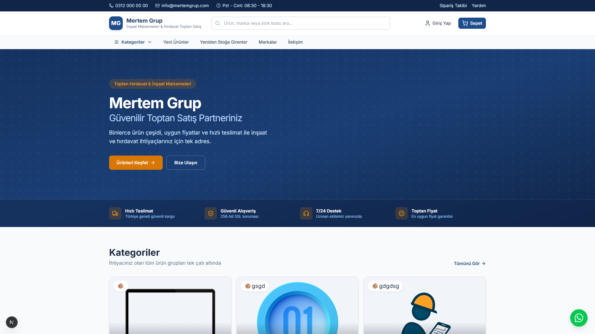
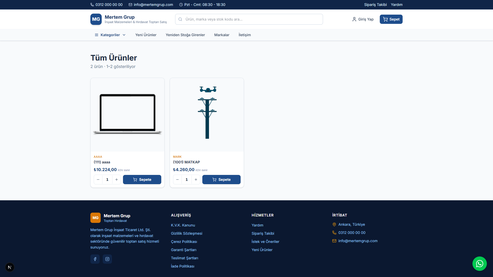
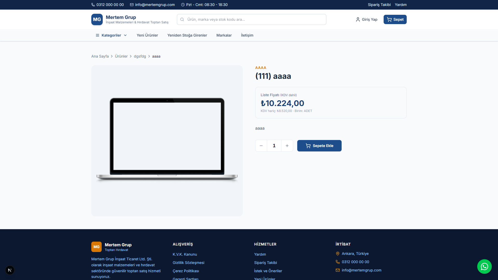

# Mertem Grup E-Ticaret

Next.js 15 fullstack mağaza uygulaması (katalog, sepet, sipariş, ödeme, admin).


**Teknik dokümantasyon:** [DOCUMENTATION.md](DOCUMENTATION.md) — mimari, API referansı, veritabanı şeması, kurulum ve deployment.

**LinkedIn paylaşım paketi:** [docs/linkedin/](docs/linkedin/) — carousel görselleri, paylaşım metni, deploy rehberi.

## Önizleme

| Ana Sayfa | Ürün Kataloğu | Ürün Detay |
|-----------|---------------|------------|
|  |  |  |

## Tech Stack

| Katman | Teknoloji |
|--------|-----------|
| Framework | Next.js 15 (App Router), React 19, TypeScript |
| Stil | Tailwind CSS v4 |
| Veritabanı | PostgreSQL 16 |
| Auth | JWT (jose) + bcrypt |
| Ödeme | iyzico, havale, kapıda ödeme |
| E-posta | Nodemailer |

## Gereksinimler

- Node.js 20+
- PostgreSQL 16+ (veya Docker)

## Kurulum

1. Bağımlılıkları yükleyin:

```bash
npm install
```

2. Ortam dosyasını oluşturun:

```bash
cp .env.example .env.local
```

3. Veritabanını kurun:

```bash
# Yerel PostgreSQL
npm run db:setup

# veya Docker ile
npm run db:setup:docker
```

4. Geliştirme sunucusu:

```bash
npm run dev
```

Site: [http://localhost:3000](http://localhost:3000)  
Admin: [http://localhost:3000/admin](http://localhost:3000/admin)  
Sağlık: [http://localhost:3000/api/health](http://localhost:3000/api/health)

Varsayılan admin: `ADMIN_EMAIL` / `ADMIN_PASSWORD` (`.env.local`).

## Canlı Demo (Deploy)

Vercel + Neon PostgreSQL ile ücretsiz deploy rehberi: [docs/linkedin/DEPLOY.md](docs/linkedin/DEPLOY.md)

## Özellikler

- Ürün / kategori / marka kataloğu
- localStorage + girişli kullanıcıda sunucu sepeti senkronu
- Misafir veya üye checkout
- Havale, kapıda ödeme, iyzico kredi kartı
- Kupon / indirim
- Sayısal stok (siparişte düşüm, iadede geri ekleme)
- Sipariş e-postası, şifre sıfırlama, iletişim formu
- Kayıtlı adresler ve profil düzenleme
- Admin: ürün, kategori, marka, kupon, sipariş (kargo takip no), iade

## Ortam değişkenleri

| Değişken | Açıklama |
|----------|----------|
| `POSTGRES_*` | Veritabanı bağlantısı |
| `JWT_SECRET` | Oturum imzalama |
| `ADMIN_EMAIL` / `ADMIN_PASSWORD` | İlk admin |
| `NEXT_PUBLIC_SITE_URL` | Callback ve e-posta linkleri |
| `IYZICO_*` | Kredi kartı (boşsa kapalı) |
| `SMTP_*` | E-posta (boşsa konsola log) |
| `BANK_IBAN` / `BANK_ACCOUNT_NAME` | Havale bilgisi |

## Yararlı scriptler

```bash
npm run kupa:import      # Kupa katalog import
npm run db:locations     # Türkiye il/ilçe verisi
npm run db:docker:up     # Sadece Postgres container
npm run build            # Production build
python scripts/build_linkedin_carousel.py   # LinkedIn carousel slaytları
python scripts/take-linkedin-screenshots.mjs  # Ekran görüntüsü (Playwright gerekir)
```

## Notlar

- Eski JSON mağaza katmanı (`data/shop.json`, `src/lib/store.ts`) runtime'da kullanılmaz; asıl kaynak PostgreSQL'dir.
- Canlı kargo firması API'si yoktur; admin siparişe takip numarası yazar.
- Production'da `JWT_SECRET`, admin şifresi, SMTP ve (gerekirse) iyzico key'lerini mutlaka doldurun.
